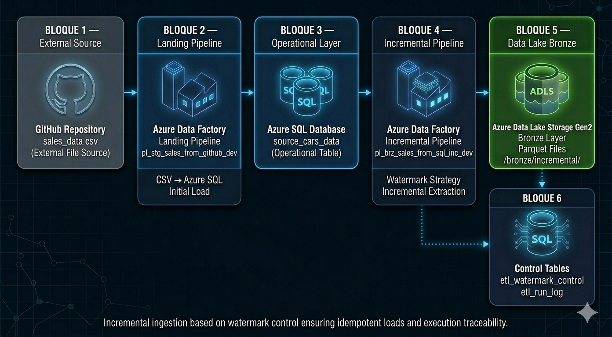
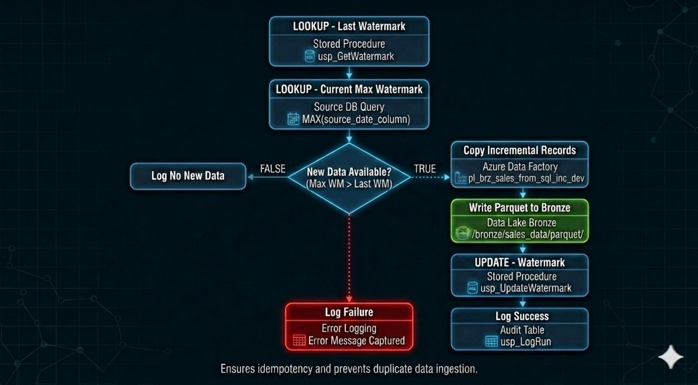
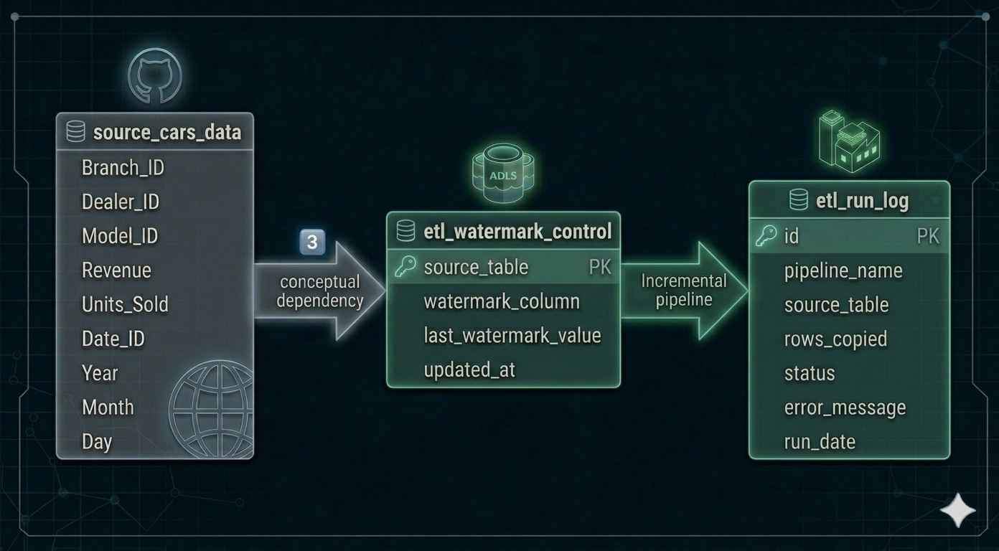

# 🚀 Arquitectura de Ingesta Incremental en Azure  
### Azure Data Factory + Azure SQL + Azure Data Lake Storage Gen2

---

## 📌 Descripción General

Este proyecto implementa una arquitectura de ingesta incremental estilo productivo utilizando:

- Azure Data Factory (ADF)
- Azure SQL Database
- Azure Data Lake Storage Gen2 (ADLS)
- Estrategia incremental basada en watermark
- Registro de ejecuciones (logging)

La solución simula un patrón empresarial en dos fases:

1️⃣ Ingesta Landing (CSV externo → SQL operacional)  
2️⃣ Extracción incremental (SQL → Data Lake Bronze en Parquet)

El diseño garantiza escalabilidad, idempotencia y trazabilidad.

---

# 🏗 Arquitectura

---

## 🔹 Capas

### 1️⃣ Fuente Externa
- Archivo CSV en GitHub
- `sales_data.csv`

---

### 2️⃣ Capa Landing (Carga Inicial)

Pipeline:
`pl_stg_sales_from_github_dev`

Responsabilidades:
- Leer CSV externo
- Cargar datos en Azure SQL
- Persistir datos operacionales

Flujo:
GitHub CSV → Azure Data Factory → Azure SQL Database

---

### 3️⃣ Capa Operacional

Tabla:
`source_cars_data`

Actúa como fuente para la extracción incremental.

---

### 4️⃣ Capa de Extracción Incremental

Pipeline:
`pl_brz_sales_from_sql_inc_dev`

Implementa lógica incremental basada en watermark.

Flujo:
Azure SQL → ADF → ADLS Bronze (Parquet)

---

### 5️⃣ Capa Bronze (Data Lake)

Estructura:

Ruta completa:

/bronze/incremental/

Características:

- Formato Parquet
- Archivos append-only
- Optimizado para analítica
- Preparado para capas Silver y Gold

---

### 6️⃣ Control y Observabilidad

Tablas:

- `etl_watermark_control`
- `etl_run_log`

Permiten:

- Control de estado incremental
- Registro de ejecuciones
- Captura de errores
- Auditoría operativa

---

# 🔁 Flujo Incremental

---

## 🔄 Lógica del Proceso

1. Obtener último watermark procesado
2. Obtener watermark máximo actual
3. Comparar valores
4. Si existe nueva data:
   - Copiar registros incrementales
   - Escribir Parquet en Bronze
   - Actualizar watermark
   - Registrar ejecución
5. Si no existe nueva data:
   - Registrar ejecución
6. Si ocurre error:
   - Capturar mensaje
   - Registrar fallo

---

# 📊 Modelo de Datos

---

## 🗄 Tabla Operacional

`source_cars_data`

Columnas:

- Branch_ID
- Dealer_ID
- Model_ID
- Revenue
- Units_Sold
- Date_ID
- Year
- Month
- Day

---

## 🧩 Tablas de Control

### `etl_watermark_control`

- source_table (PK)
- watermark_column
- last_watermark_value
- updated_at

---

### `etl_run_log`

- id (PK)
- pipeline_name
- source_table
- rows_copied
- status
- error_message
- run_date

---

# 🧩 Decisiones de Diseño

- Se eligió estrategia watermark en lugar de full load para mejorar escalabilidad.
- Se seleccionó formato Parquet por eficiencia de almacenamiento.
- Se implementaron tablas de control para observabilidad.
- Se añadió capa de logging para simular monitoreo productivo.
- Arquitectura en dos fases para reflejar patrones empresariales reales.

---

# ⚙ Tecnologías Utilizadas

- Azure Data Factory
- Azure SQL Database
- Azure Data Lake Storage Gen2
- Parquet
- Stored Procedures (T-SQL)
- Integración Git

---

# 🧠 Conceptos Demostrados

- Arquitectura incremental
- Idempotencia
- Control por watermark
- Observabilidad operativa
- Separación de capas
- Patrón empresarial de ingesta

---

# 👨‍💻 Autor

John Ramirez  
Ingeniero de Datos – Azure
